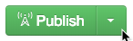
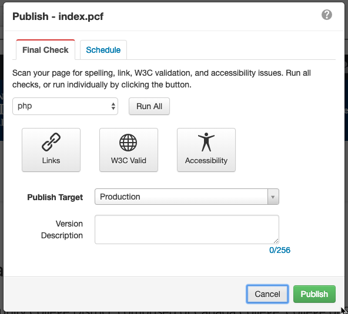
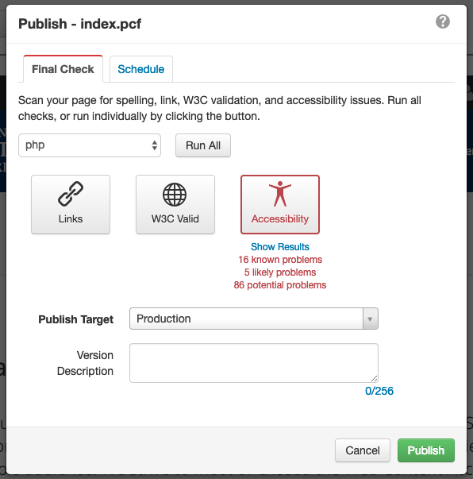
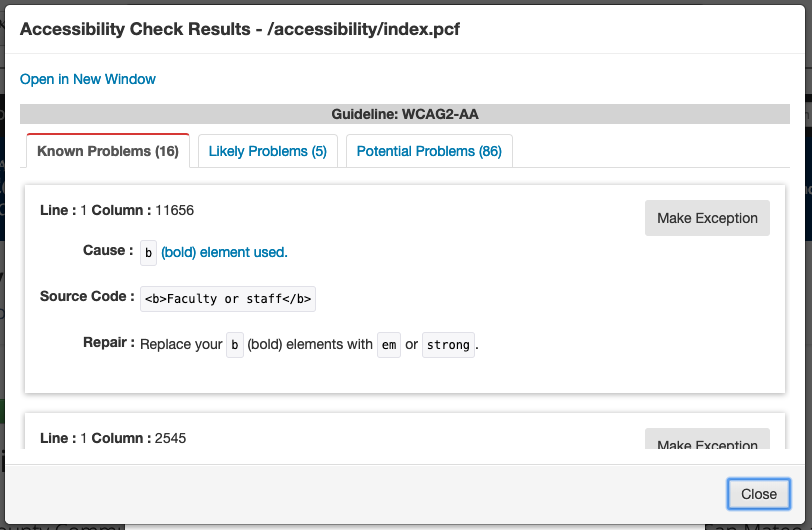

Once you feel that your page is ready for the world to see, there is one more step before you **Publish** the page to ensure that it is accessible to all audiences.

**1. Press the _Publish Button_ (seen in the following image).**

**2. The _Publish Dialog box_  should pop up with a few options before publishing.**

In order to best prepare your site, I suggested running both the Broken Link Checker (labeled as _"Links"_) and fixing any issues it finds, as well as the Accessibility Checker.

📝 I will cover the basics of the broken link checker in a different post and include more detail about that. The link will be updated in this post when it's ready.

**3. See the initial results of the scan that you ran.**

The problems are broken down into 3 categories.
1. Known Problems
2. Likely Problems
3. Potential Problems

**4. Examime to detailed results to see if there is anything you can fix before finally publishing the page.**

⚠️ The main area to be concerned about is **"Known Problems"**, but if you have questions about any of the results of your scan you can [E-mail Bryan Besnyi](mailto:besnyib@smccd.edu)