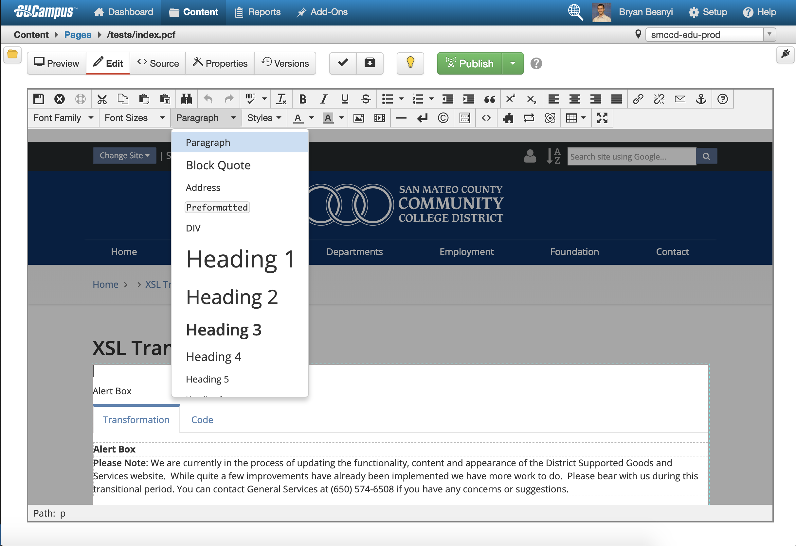

Headings are not only important to screen reader users and users of other assistive technology, but also to sighted users for quickly understanding page hierarchy.

> Accessible content begins with well-structured copy. At the page level, structure helps readers understand which text on a page is most important. Using clear and concise headings makes it easy for someone to skim the page and understand the information they’re likely to find.
>> Excerpt from *Accessibility for Everyone* by *Laura Kalbag*

Headings provide both a primary method of navigation and page hierarchy to users of assistive technology. When structuring content for posting to the web, it is important to use headers in a sequential and logical manner.

To better understand headings, it is best to look the _document outline_, which users of assistive technology can use to traverse the page efficiently. 

It is also important to note that, while the **Heading 1** does not need to be the first heading on any given page, each page should have one and only one **Heading 1**. 

Also, each **Heading 1** should be followed by a **Heading 2** and each **Heading 2**, and if further nesting is needed, should be followed by a **Heading 3**. 

Important Note: Jumping from a **Heading 1** to a **Heading 3** or **Heading 4** and so on can cause confusion for screen reader users.
