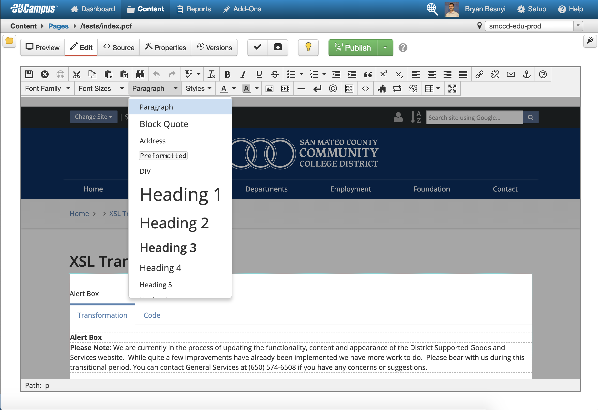

Headings provide both a primary method of navigation and page hierarchy to users of assistive technology. When structuring content for posting to the web, it is important to use headers in a sequential and logical manner.

To better understand headings, it is best to look the _document outline_, which users of assistive technology can use to traverse the page efficiently. 

It is also important to note that, while the **Heading 1** does not need to be the first heading on any given page, each page should have one and only one **Heading 1**
