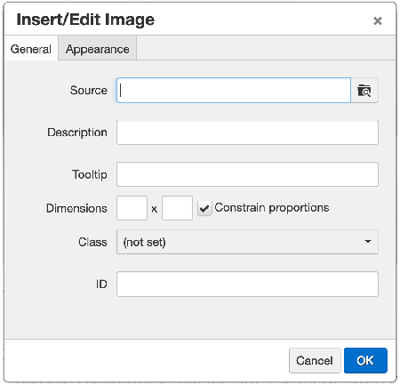

Images by default are inaccessible to those who cannot see them due to poor vision or blindness.

## Images Need Descriptions

- We need to provide descriptions for anything that contains informative content.
- Photos can be appropriate descripted using the *Description* field (pictured in preceeding photo), which contains a succinct description of the content of the image.
- Keep in mind that we are just trying to convey the content of the image to the user and are not trying to overwhelm them with a wordy description.

## For Complex Images Like Graphs

We can provide a description of the image within the text adjacent to the image. Be sure that the *full* contents of the image are portrayed in this description. There are other approaches using HTML that can also be used. [E-mail Bryan Besnyi](mailto:besnyib@smccd.edu) if you have any questions about how this can be achieved.

## Decorative Images

If for some reason an image is added to the page and it does not require an explanation, if used for look or feel for example, we can give leave the *Description* field empty, which will tell screen readers to ignore it.

**NOTE**: Use caution with an empty description field. If there are words on the image, or the image links to another page, the *Description* field must not be empty.
